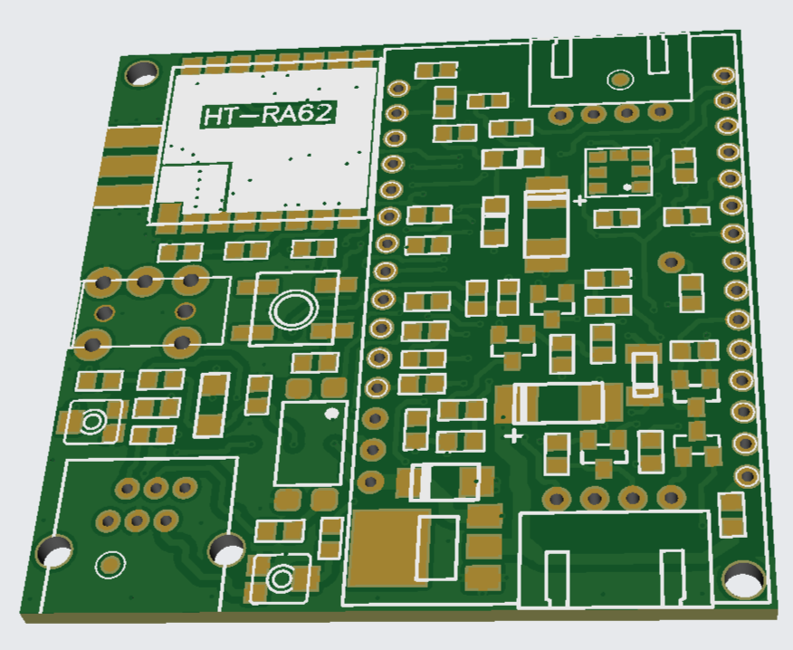

Внешний вид платы APRS_LoraNode:

Схема подключения периферийных модулей к APRS_LoraNode:

Распиновка портов ввода-вывода ESP32 APRS_LoraNode
==========================================

| Сигнальная цепь | Обозначение портов ESP32 | Примечание |
|:------------------:|:-----:|:-----------------|
| MIC | GPIO 26 | Линия MIC APRS модема |
| SQL  | GPIO 25 | Линия SQL APRS модема |
| SPK  | GPIO 36 | Линия SPK APRS модема |
| PTT  | GPIO 17 | Линия PTT APRS модема |
| ----  | ---- | ---- |
| DIO 1  | GPIO 33 | Прерывания HT-RA62 |
| ----  | ---- | ---- |
| RST | GPIO 23 | Сброс HT-RA62 |
| MISO | GPIO 19 |Линия данных HT-RA62 |
| MOSI | GPIO 27 | Линия данных HT-RA62  |
| SCK | GPIO 5 | Clock SPI HT-RA62  |
| NSS | GPIO 18 | Chip select SPI HT-RA62  |
| BUSY | GPIO 32 | Состояние модема HT-RA62 |
| RXEN | GPIO 14 | Не используется |
| TXEN | GPIO 13 | Не используется |
| ---- | ---- | ---- |
| SDA | GPIO 21 | Интерфейс I2C |
| SCK | GPIO 22 | Интерфейс I2C |
| ---- | ---- | ---- |
| GPS_EN | GPIO 4 | Управление питанием GPS-модуля (5V)|
| GPS_TX | GPIO 12 | Выход передатчика UART |
| GPS_RX | GPIO 15 | Вход приемника UART |
| ---- | ---- | ---- |
| BUTTON_PIN | GPIO 39 | Кнопка выбора режимов работы |
| BATTERY_PIN | ---- | Не используется |
| EXT_PWR_DETECT | ---- | Не используется |
| ---- | ---- | ---- |
| 1-WIRE | GPIO 13 | Не используется |
| ---- | ---- | ---- |
| LED_PIN | GPIO 2 | Выход "Открытый коллектор" |
| BEEP | ---- | Не используется |

Внешний вид модуля APRS_LoraNode:

