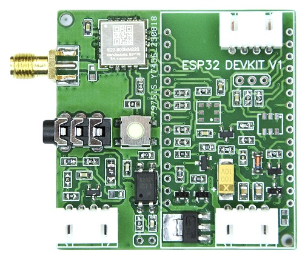

Внешний вид платы LoraNode868_E22:

Схема подключения периферийных модулей к LoraNode868_E22:

Распиновка портов ввода-вывода ESP32_DEVKIT_V1 (30pin)
==========================================

| Сигнальная цепь | Обозначение порта ESP32 | Примечание |
|:------------------:|:-----:|:-----------------|
| DIO 0 | ---- | Не используется |
| DIO 1  | GPIO 33 | Прерывания E22-900MM22S |
| DIO 2  | ---- | Не используется |
| DIO 3  | ---- | Не используется |
| ---- | ---- | ---- |
| RST | GPIO 23 | Сброс RFM95W |
| MISO | GPIO 19 |Линия данных RFM95W |
| MOSI | GPIO 27 | Линия данных RFM95W  |
| SCK | GPIO 5 | Clock SPI RFM95W  |
| NSS | GPIO 18 | Chip select SPI RFM95W  |
| BUSY | GPIO 32 | линия состояния модема SX1262 |
| RXEN | GPIO 14 | управление РЧ-переключателем |
| TXEN | GPIO 13 | управление РЧ-переключателем |
| ---- | ---- | Не используется |
| SDA | GPIO 21 | Интерфейс I2C |
| SCK | GPIO 22 | Интерфейс I2C |
| ---- | ---- | ---- |
| GPS_EN | GPIO 4 | Управление питанием GPS-модуля|
| GPS_RX | GPIO 12 | вход приемника UART |
| GPS_TX | GPIO 15 | выход передатчика UART |
| ---- | ---- | ---- |
| BUTTON_PIN | GPIO 39 | Кнопка выбора режимов работы |
| BATTERY_PIN | GPIO 35 | Напряжение питания (резистивный делитель) |
| EXT_PWR_DETECT | ---- | Не используется |
| Monitor Pin | GPIO 25 |  |
| LED_PIN | GPIO 2 | Синий светодиод |
| BEEP | ---- | Не используется |
