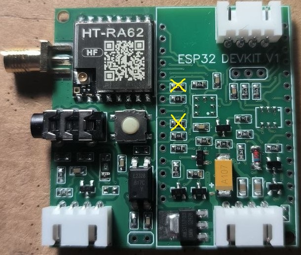
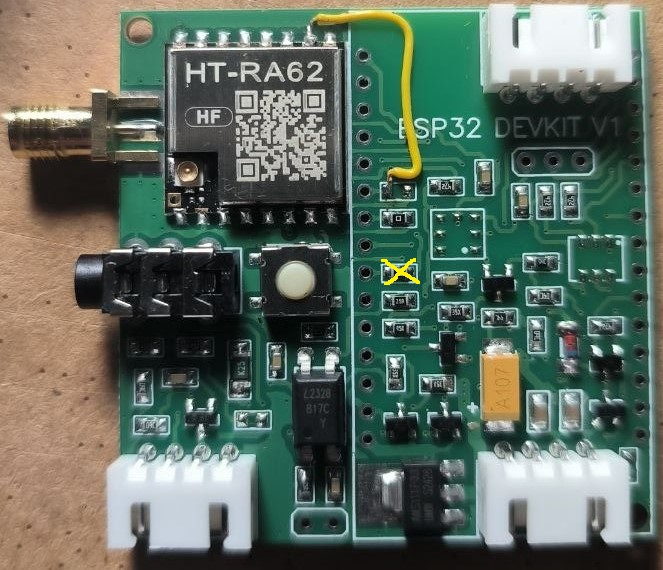
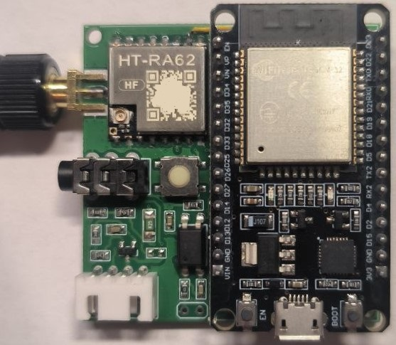

Доработка модуля LoraNode868_RA01 под установку HT-RA62 (чип SX1262 на 868МГц):

Шаг 1. Удалить два резистора 0 Ом в соответствии с эскизом:

Шаг 2. Выполнить перемычку (линия BUSY) между модулем HT-RA62 (контакт ХХ) и ESP32 (контакт YY) в соответствии с эскизом:

Шаг 3. Выполнить перемычку (линия BUSY) между модулем HT-RA62 (контакт ХХ) и ESP32 (контакт YY) в соответствии с эскизом:

