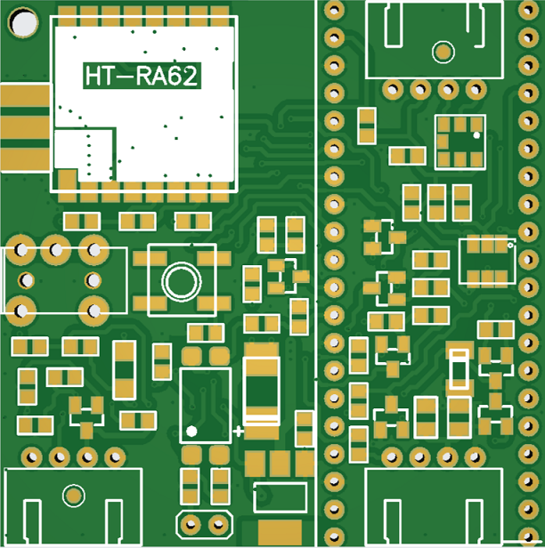

Внешний вид платы LoraNode868_RA62_PICO:

Схема подключения периферийных модулей к LoraNode868_RA62_PICO:

Распиновка портов ввода-вывода RPi Pico
==========================================

| Сигнальная цепь | Обозначение портов RPi Pico | Примечание |
|:------------------:|:-----:|:-----------------|
| ---- | ---- | ---- |
| DIO 1  | GPIO 33 | Прерывания HT-RA62 |
| ----  | ---- | ---- |
| DIO 3  | ---- | Не используется |
| ---- | ---- | ---- |
| RST | GPIO 23 | Сброс HT-RA62 |
| MISO | GPIO 19 |Линия данных HT-RA62 |
| MOSI | GPIO 27 | Линия данных HT-RA62  |
| SCK | GPIO 5 | Clock SPI HT-RA62  |
| NSS | GPIO 18 | Chip select SPI HT-RA62  |
| BUSY | GPIO32 | Состояние модема HT-RA62 |
| RXEN | ---- | Не используется |
| TXEN | ---- | Не используется |
| ---- | ---- | Не используется |
| SDA | GPIO 21 | Интерфейс I2C |
| SCK | GPIO 22 | Интерфейс I2C |
| ---- | ---- | ---- |
| GPS_EN | GPIO 4 | Управление питанием GPS-модуля|
| GPS_RX | GPIO 12 | вход приемника UART |
| GPS_TX | GPIO 15 | выход передатчика UART |
| ---- | ---- | ---- |
| BUTTON_PIN | GPIO 39 | Кнопка выбора режимов работы |
| BATTERY_PIN | GPIO 35 | Напряжение питания (резистивный делитель) |
| EXT_PWR_DETECT | ---- | Не используется |
| ---- | GPIO 25 | ---- |
| LED_PIN | GPIO 2 | Синий светодиод |
| BEEP | ---- | Не используется |

Внешний вид модуля RPi Pico:

